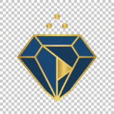

<div dir="rtl" style="font-family: sans-serif; line-height: 1.6;">

<div align="center">
  
  
  # شذرات | Shadharat
  
  **منصة بث رقمي حديثة تهدف إلى تقديم المحتوى الديني والثقافي الموثوق**
  
  <br/>
</div>

هذا المستودع يحتوي على التوثيق الرسمي والكامل لمشروع **شذرات**. يهدف هذا التوثيق ليكون المرجع الأساسي للفريق التقني والإداري لفهم وتنفيذ المشروع.

## � محتويات التوثيق

يغطي التوثيق الجوانب التالية:

### 1. [نظرة عامة (Overview)](./docs/01-overview)
*   تعريف المنصة والرؤية.
*   الجمهور المستهدف.

### 2. [المنصات (Platforms)](./docs/02-platforms)
*   تطبيقات الجوال (Flutter/React Native).
*   منصة الويب (Next.js).
*   تطبيقات التلفاز (TV Apps).

### 3. [الميزات والخصائص (Features)](./docs/03-core-features)
*   مشغل الفيديو والتشغيل في الخلفية.
*   البحث المتقدم.
*   وضع الأوفلاين (Offline Mode).

### 4. [هيكلة المحتوى (Content)](./docs/04-content-structure)
*   الأقسام الرئيسية (بودكاست، مرئيات).
*   ملفات المشايخ.
*   الشورتس (Shorts).

### 5. [تجربة المستخدم (UX)](./docs/05-user-experience)
*   واجهة المستخدم الرئيسية.
*   وضع الأطفال (Kids Mode).
*   نظام التخصيص.

### 6. [الإدارة والأعمال (Admin)](./docs/06-admin-business)
*   لوحة التحكم (CMS).
*   نموذج العمل والاشتراكات.

---
<br/>
</div>

## 🛠️ Technical Setup

This documentation site is built using [Docusaurus 3](https://docusaurus.io/).

### Prerequisites
*   Node.js (version 18 or higher)
*   `bun` (recommended) or `npm`

### Running Locally

```bash
# Install dependencies
bun install

# Start the development server
bun start
```

The site will be available at `http://localhost:3000`.

### Building for Production

```bash
bun run build
```
